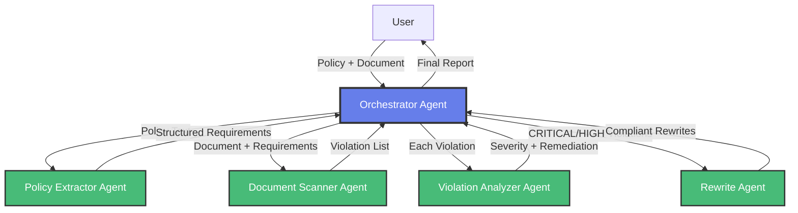

# Architecture Diagram

To generate the architecture diagram, you can use tools like:

1. **Draw.io** (https://app.diagrams.net/)
2. **Mermaid** (included below)
3. **Lucidchart**
4. **Excalidraw**

## Mermaid Diagram Code


## To Generate PNG

1. Copy the Mermaid code above
2. Go to https://mermaid.live/
3. Paste the code
4. Download as PNG
5. Save as `architecture_diagram.png` in this directory
````